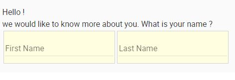

# IRA

Note: This is work-in-progress we are still building this up. The public beta release will be with version 3.1 this summer. 

## Intro

IRA stands for IRIS Application is a way to easily build flexible,scalable and high-quality applications.

It starts by providing the ability to make creating forms extremely easy using an extended
markdown like syntax we call formdown.

```
Hello !

we would like to know more about you. What is your name ?

[First Name][firstName] [Last Name][lastName]
```    

A definition like this would result in this:



Rendering a form like this is easy and can be helpful standalone.

Forms are usually used to collect data though and thus by default forms are the basis to create documents.  

## Features

IRIS has been designed as a progressive architecture from small forms and designs on a static webpage to full-fledged enterprise ready
business applications. The key is to allow for different usage levels. Not everybody needs a fully hosted, company
workflow integrated hosted solution with snapshots, staging, history rollback etc. 

  * Flexible Forms
  * Hierachical Document Storage
  * Versioning
  * Controls
  * Designs
  * Lists
  * Queries
  * Controllers
  * Business Rules
  * Hosted Services

... and more

--- There will be more documentation here in the near future

## Questions

Q: Do you have a WYSIWYG form designer ?

A: No. We decided early on to not supply that yet. A form definition should be about structural content first and
users should concentrate on what they want to capture first and not too much on how it looks. The rendered forms look
very nice out ouf the box and can then be styled and influenced using controls. They can also be mixed and matched with
HTML templates.

Part of becoming more productive building any application means a good seperation of work and responsibilities. 
The few forms that are constantly being used and where the default look doesn't suffice can easily be restyled
after the fact by an actual HTML designer or developer. More importantly though during the design phase the 

That said we are not totally opposed to it and if we find a good way to ensure a nice design experience without
overloading it we might do it one day but current day form designers often become a poor mans html designer tool and there
are already a number of those around.

## Background

In progress :) We are currently moving this over from our internal system. This will take a few weeks ...


## Initialization

- load core (only rs-*,template rewriter)
- route mode -> find layout and document
- render main component (layout || form) 
- load document
- store document in local store
- build document class around raw document
